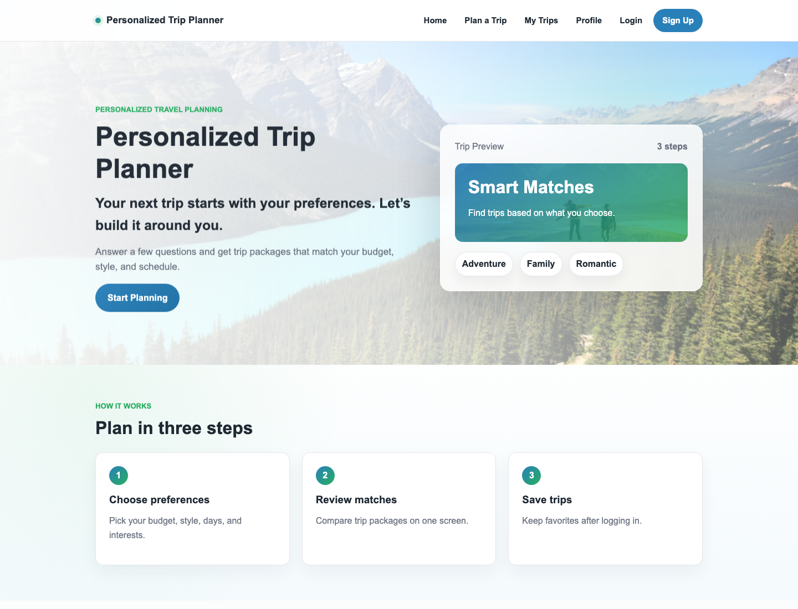
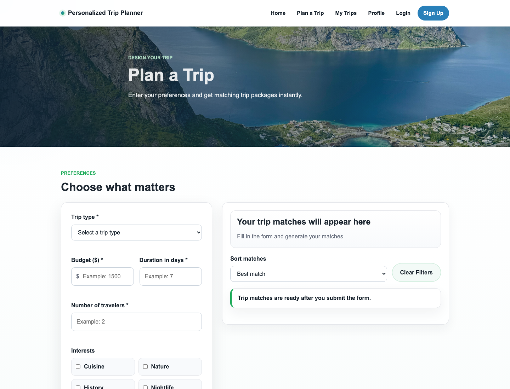
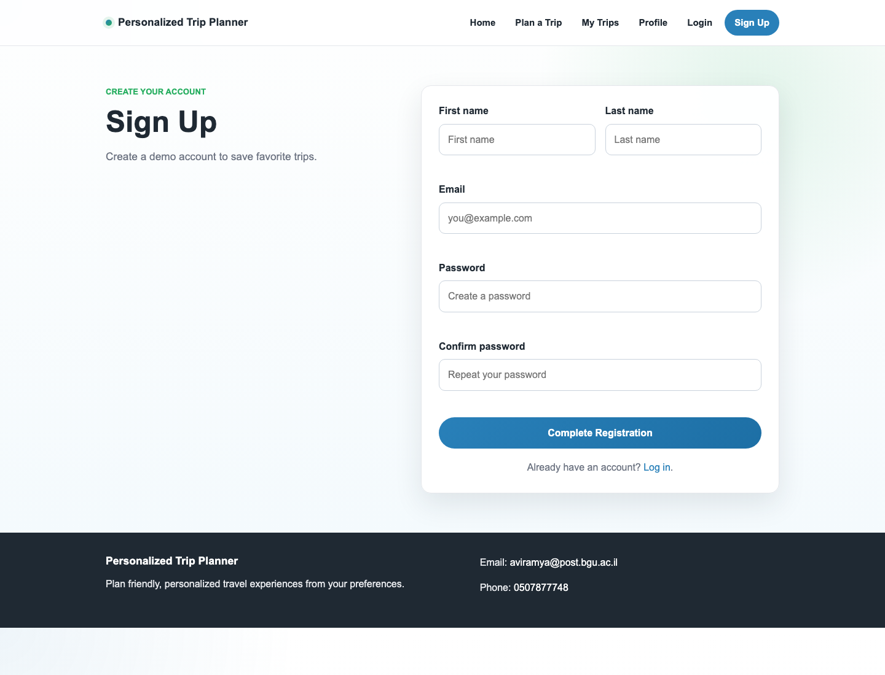
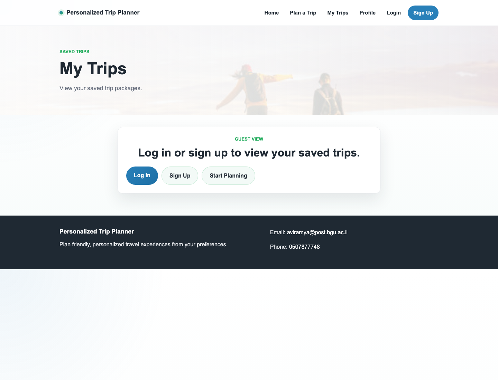

# Personalized Trip Planner

A full-stack travel planning web application that helps users discover trip packages based on their travel style, budget, duration, group size, interests, and kosher-friendly preference.

The project includes a polished multi-page frontend, an Express API layer, and SQL Server scripts for storing users, trips, interests, saved trips, itineraries, and reviews.

## Preview

### Home



### Plan a Trip



### Sign Up



### My Trips



## Highlights

- Personalized trip search based on trip type, budget, duration, travelers, interests, and kosher-friendly preference.
- Trip package cards with pricing, duration, ratings, descriptions, tags, and local destination imagery.
- Trip details page with itinerary, reviews, trip metadata, and save action.
- User signup, login, profile update, and password update flows.
- Saved trip management, including status updates and removal.
- SQL Server schema and seed scripts for repeatable local setup.
- Local image assets for all main trip and page visuals.

## Tech Stack

- HTML5
- CSS3
- Vanilla JavaScript
- Node.js
- Express.js
- Microsoft SQL Server
- `mssql` Node package
- Azure Data Studio or another SQL Server client

## Project Structure

```text
personalized-trip-planner-part-c/
├── assets/
│   └── images/              # Local trip and page images
├── css/
│   └── style.css            # Shared application styles
├── db/
│   ├── schema.sql           # Database and table definitions
│   ├── seed.sql             # Demo data
│   └── fix_image_paths.sql  # Optional image path maintenance script
├── docs/
│   └── screenshots/         # README screenshots
├── js/                      # Frontend behavior by page/feature
├── pages/                   # Login, signup, planner, details, profile, saved trips
├── server/
│   ├── app.js               # Express app and API routes
│   ├── db.js                # SQL Server connection helper
│   └── db.config.example.js # Local database config template
├── index.html               # Home page
├── package.json
└── README.md
```

## Getting Started

### 1. Install Dependencies

```bash
npm install
```

### 2. Configure SQL Server

Create a local database config file:

```bash
cp server/db.config.example.js server/db.config.js
```

Update `server/db.config.js` with your SQL Server username, password, host, port, and database name.

The expected database name is:

```text
personalized_trip_planner
```

### 3. Create and Seed the Database

Open the scripts in Azure Data Studio or another SQL Server client and run them in this order:

```text
db/schema.sql
db/seed.sql
```

For an existing database that needs image path cleanup, run:

```text
db/fix_image_paths.sql
```

### 4. Start the App

```bash
npm start
```

For development with automatic restarts:

```bash
npm run dev
```

Then open:

```text
http://localhost:3000
```

## Database Model

The SQL Server database stores:

- `users` - Account profile data and demo passwords.
- `trips` - Trip packages, destinations, prices, durations, descriptions, and image paths.
- `interests` - Available interest tags.
- `trip_interests` - Many-to-many relationship between trips and interests.
- `itinerary_days` - Day-by-day trip itinerary content.
- `saved_trips` - Trips saved by users, including saved status.
- `reviews` - User-submitted trip ratings and comments.

## API Reference

### Health Checks

| Method | Endpoint | Purpose |
| --- | --- | --- |
| `GET` | `/api/test` | Confirm the Express server is running |
| `GET` | `/api/db-test` | Confirm SQL Server connectivity |

### Authentication

| Method | Endpoint | Purpose |
| --- | --- | --- |
| `POST` | `/api/auth/signup` | Create a user account |
| `POST` | `/api/auth/login` | Log in with email and password |

### Trips

| Method | Endpoint | Purpose |
| --- | --- | --- |
| `GET` | `/api/trips` | Get all trip packages |
| `POST` | `/api/trips/search` | Search trips from user preferences |
| `GET` | `/api/trips/:id` | Get one trip by id or slug |
| `POST` | `/api/trips/:tripId/reviews` | Add a review for a trip |

### Users and Saved Trips

| Method | Endpoint | Purpose |
| --- | --- | --- |
| `GET` | `/api/users/:userId` | Get one user profile |
| `PUT` | `/api/users/:userId/profile` | Update profile details |
| `PUT` | `/api/users/:userId/password` | Update password |
| `POST` | `/api/saved-trips` | Save a trip |
| `GET` | `/api/users/:userId/saved-trips` | Get saved trips for a user |
| `PUT` | `/api/saved-trips/:savedId/status` | Update saved trip status |
| `DELETE` | `/api/saved-trips/:savedId` | Remove a saved trip |

## Demo Flow

1. Open the home page.
2. Select **Start Planning**.
3. Enter travel preferences and generate matches.
4. Open a trip package to view its details.
5. Sign up or log in.
6. Save trips to **My Trips**.
7. Update saved trip status or remove saved trips.
8. Edit profile details or change the password.
9. Add a review to a trip package.

## Example API Checks

```bash
curl http://localhost:3000/api/test
curl http://localhost:3000/api/db-test
curl http://localhost:3000/api/trips
curl http://localhost:3000/api/trips/1
curl http://localhost:3000/api/users/4
curl http://localhost:3000/api/users/4/saved-trips
```

## Security Notes

This is a university course project and keeps several implementation choices intentionally simple:

- `server/db.config.js` contains local-only database credentials and is ignored by Git.
- Demo passwords are stored as plain text.
- Production authentication should use password hashing such as bcrypt.
- Production sessions should use secure cookies, sessions, or tokens instead of client-side demo state.
- Input validation exists, but a production system would need broader validation, authorization checks, logging, and error handling.

## Known Limitations

- A local SQL Server instance is required for API-backed search, authentication, trip details, saved trips, and reviews.
- Review editing and deletion are not implemented.
- Users can save each trip once.
- Users can write one review per trip.
- Some image fallback logic is included in case a local asset path is missing.

## Course Context

The course examples used MySQL, while this implementation uses Microsoft SQL Server with Azure Data Studio for database management.
